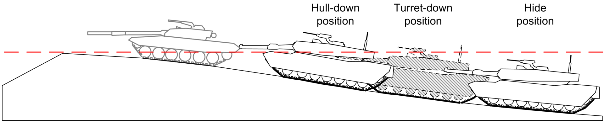

# Veicoli Corrazzati

I veicoli corrazzati sono un grande moltiplicatore di forza per la fanteria che supportano. Impiegarli in modo efficace, mitigando i loro punti deboli, richiede però delle buone facoltà in materia, sia da parte dell'equipaggio che i capi di squadre meccanizzate.

## Le categorie di veicoli

I cosidetti "veicoli corrazzati" o "Armoured Fighting Vehicles" si possono definire in 4 principali categorie:

- **APC (Veicolo Trasporto Truppe):** 
  Un veicolo corrazzato capace di trasportare fanteria sul campo di battaglia, proteggendola da fuoco di fucili d'assalto (eventualmente anche .50) e frammenti di granate. 
  Comunemente armato con mitragliatrici di calibro medio (7.62mm) o pesante (HMG .50), oppure lanciagranate automatici (GMG 40mm). 
  Esempi: [M113](https://it.wikipedia.org/wiki/M113), [Stryker](https://it.wikipedia.org/wiki/Stryker), [AAV-7](https://it.wikipedia.org/wiki/AAV7), [BTR-40](https://it.wikipedia.org/wiki/BTR-40)/[60](https://it.wikipedia.org/wiki/BTR-60)/[70](https://it.wikipedia.org/wiki/BTR-70).
- **IFV (Veicolo da Combattimento Corrazzato):** 
  L'evoluzione dell'APC. Oltre a proteggere i passeggeri passivamente con la corrazza, il suo armamento maggiore gli permette di rimanere sul campo per supportare la fanteria sbarcata contro varie minacce. 
  Comunemente armato con un cannone automatico da >20mm con munizioni AP e HE, molto letale contro fanteria nemica e veicoli leggeri a distanze elevate. Alcuni montano anche ATGM letali per MBT. 
  Esempi: [M2 Bradley](https://it.wikipedia.org/wiki/M2/M3_Bradley), [LAV-25](https://it.wikipedia.org/wiki/LAV-25), [Freccia](https://it.wikipedia.org/wiki/Freccia_(combattimento_fanteria)), [Dardo](https://it.wikipedia.org/wiki/Dardo_(combattimento_fanteria)), [BMP](https://it.wikipedia.org/wiki/BMP-1), [BTR-80A](https://it.wikipedia.org/wiki/BTR-80#Varianti).
- **MBT (Carro da Combattimento):** 
  Un carro da battaglia, monta una corrazza spessa e cannone di grosso calibro (>90mm), capace di demolire con colpi HE veicoli leggeri a distanze elevate e distruggere bersagli corrazzati con munizioni AP. 
  Esempi: [M1 Abrams](https://it.wikipedia.org/wiki/M1_Abrams), [Ariete](https://it.wikipedia.org/wiki/Ariete_(carro_armato)), [Leopard 2](https://it.wikipedia.org/wiki/Leopard_2), [T-62](https://it.wikipedia.org/wiki/T-62)/[72](https://it.wikipedia.org/wiki/T-72)/[80](  https://it.wikipedia.org/wiki/T-80).
- **TD (Cacciacarri):** 
  Meno corrazzato di un carro da battaglia, ma in compenso più mobile, per aggirare formazioni nemiche e colpirle nei fianchi. 
  Armato per demolire MBT, con un cannone di alto calibro (>90mm) e munizioni AP. Alcune varianti sono basate su piccoli APC come il M113 e montano ATGM. 
  Esempi: [M901 ITV](https://en.wikipedia.org/wiki/M901_ITV), [Stryker MGS](https://en.wikipedia.org/wiki/M1128_mobile_gun_system), [B1 Centauro](https://it.wikipedia.org/wiki/Centauro_(autoblindo)).

## Coordinamento dell'equipaggio

A differenza di altri veicoli pesanti e ingombranti come gli elicotteri, il pilota del carro riceve ordini di manovra dal capocarro, che gode di una SA molto maggiore della sua. Per manovrare quindi il mezzo in modo efficace e sicuro, devono vigere delle procedure di comunicazione ben chiare tra tutti i membri dell'equipaggio.

### Ruoli e responsabilità

L'equipaggio consiste di 3 figure principali: capocarro, artigliere e pilota. Sono elencati di seguito con il loro nominativo di chiamata.

- ^^Commander:^^ 
  Il capocarro, responsabile di dare ordini di ingaggio e manovra ai suoi sottoposti, senza perdere di vista la situazione tattica in cui si trova e mantenendo sempre le comunicazioni con l'esterno. È spesso munito di un MG medio/pesante, sotto forma di torretta remota o manuale, montata in cima alla torretta principale. 
  Su veicoli con solo 2 posti di equipaggio (es: [Wiesel](https://it.wikipedia.org/wiki/Wiesel_(combattimento_fanteria))), il capocarro funge anche da artigliere.
- ^^Gunner:^^ 
  L'artigliere del veicolo, secondo al comando dell'equipaggio. È responsabile dell'armamento primario, comprendente spesso la torretta con cannone e/o lanciatore.
- ^^Driver:^^ 
  Il pilota del veicolo, responsabile di manovrarlo seguendo gli ordini e l'intenzione del capocarro. Nel caso di riparazioni sul campo, lui è il primo in linea a sbarcare per effettuarle.

Esistono ulteriori figure minori dell'equipaggio, in ruoli che non vengono però sempre assegnati su Arma, siccome possono risultare superflui e/o noiosi da ricoprire.

- ^^Loader:^^ 
  Responsabile di [caricare il cannone principale](https://youtu.be/sC2ePKRvo9k), azione necessaria nella realtà ma quasi sempre superflua su ArmA 3, siccome la maggioranza dei carri implementano auto-loader. 
  Ha responsabilità secondarie di supportare la riparazione del veicolo e operare l'eventuale MG montato sulla torretta, davanti alla sua botola.
- ^^Hull:^^ 
  Va a interpellare il cosiddetto "Hull Gunner", collocato accanto al pilota nello scafo e munito di un MG che copre l'arco frontale del proprio veicolo. Presente principalmente su carri dell'epoca WW2, dove era anche responsabile di gestire la radio del veicolo, siccome il capocarro non poteva fisicamente accederci.

### Manovre basilari

#### Orientamento

Con =="^^Driver/Gunner,^^ orienta prua/direzione"== comandiamo l'orientamento dello scafo o della torretta (a seconda del membro interpellato) nella data direzione. Possiamo comunicare la direzione desiderata come prua magnetica, oppure relativa allo scafo del veicolo.

<!-- Immagine con esempi -->

!!! note "Il comando dato al Driver NON implica l'annullamento di un movimento attuale in avanti o indietro."

#### Movimento

Con semplici ordini di verso e velocità, es: =="^^Driver,^^ avanti a passo d'uomo"== (per tenere passo con i fanti sbarcati) o =="^^Driver^^, indietro veloce!"==, viene comandato un dato movimento. Esso è da continuare a tempo indeterminato finché annullato da un ordine successivo, come =="^^Driver^^, stop"==.

In alternativa, ordini di movimento possono anche essere limitati nel tempo da una certa condizione, come per esempio:

> ^^Driver^^, avanti lento ==finché siamo in cima al crinale==.

> ^^Driver^^, avanti ==fino al prossimo incrocio, fermati 10m prima==.

> ^^Driver^^, indietro veloce ==fino alla strada==.

#### Sterzate

Durante una manovra è spesso necessario dare brevi ordini di sterzata al driver, che risulterebbero troppo complessi se comunicati come quelli di orientamento. Qui alcuni esempi:

> ^^Driver^^, ==destra pieno!== (corrisponde a 90°)

> ^^Driver^^, ==sinistra mezzo!== (corrisponde a 45°)

> ^^Driver^^, ==destra quarto!== (corrisponde a ~23°)

<!-- immagine di spiegazione -->

!!! note "Muovendo indietro con un mezzo ruotato, bisogna quindi sterzare con il tasto opposto, al fine di orientare lo scafo sempre nella direzione comandata"

### Manovre avanzate

#### Hull/Turret Down

Quando vicini ad un crinale (o ostacolo artificiale simile) che ci offre copertura, possiamo posizionare il nostro veicolo in uno di molteplici modi ben definiti:

- ^^Hull-Down:^^ 
  Espone al nemico solo la nostra torretta principale, permettendoci di osservarlo e ingaggiarlo liberamente, coprendo allo stesso tempo il nostro scafo, che è generalmente meno corrazzato della torretta e contiene componenti vitali come motore e carburante. Inoltre in alcuni IFV o MBT moderni, dove la torretta è totalmente remota, ci permette di proteggere più facilmente l'intero equipaggio.
- ^^Turret-Down:^^ 
  Espone al nemico il meno possibile del nostro profilo, soltanto il periscopio/torretta del capocarro (oppure lui stesso fuori dalla botola). 
  Questo ci permette di osservarlo liberamente, mantenendo la massima abilità di manovra per avanzare velocemente in ^^Hull-Down^^ e ingaggiare, oppure indietreggiare in ^^Hide Position^^ per riposizionarci (es: [Jockey](#jockey)) o ritirarci.
- ^^Hide Position:^^ 
  Manteniamo il veicolo totalmente nascosto da eventuali osservatori oltre il crinale, idalmente spegnendo anche il motore per impedire l'avvistamento del nostro fumo di scarico. 
  Da questa posizione il capocarro o personale aggiuntivo (che non sia pilota o artigliere, fondamentali per manovra e ingaggio immediati) può sbarcare e posizionarsi furtivamente sul crinale per scrutare il terreno con il proprio binocolo e pianificare le prossime manovre e/o ingaggi, rimanendo visibile al nemico solo quanto un normale fante ricognitore.

- Per entrare in ^^Hull-Down^^:
    - Il capocarro ordina =="^^Driver^^, hull-down, avanti N metri"==.
    - Il pilota inizia il movimento comandato, rallentando in prossimità del crinale per ricevere indicazioni precise sul posizionamento.
    - Siccome è la visuale dell'artigliere che conta per la posizione, è colui che procede a dare gli ordini sul posizionamento, per esempio con: =="^^Driver^^, avanti lento, 3 metri ... 2, 1, stop!"==.
- Per entrare in ^^Turret-Down^^ il procedimento è identico al Hull-Down, ma siccome conta la visuale del capocarro è lui a dare indicazioni precise sul posizionamento.
- Per tornare in ^^Hide Position^^ basta che il capocarro dia l'ordine =="^^Driver^^, indietro 10m"==, seguito da eventuali comandi ulteriori finché il veicolo si trova nella posizione desiderata, sempre secondo la visuale del capocarro.

<!-- Immagine frontale in-game delle varie posizioni del diagramma -->

#### Jockey

Quando siamo in posizione di fuoco, orientati perpendicolarmente rispetto ad un crinale, il capocarro può usare la seguente brevity per ordinare al volo lo spostamento laterale in una nuova posizione lungo il crinale.

> ^^Driver^^, ==jockey a destra/sinistra, N metri!==

Di conseguenza, il pilota deve:

1. Manovrare indietro in **Hide Position**, in modo da nascondere la manovra di riposizionamento agli occhi del nemico.
2. Orientarsi in parallelo lungo il crinale usato come copertura, nella direzione comandata.
3. Muovere alla massima velocità utile lungo il crinale, per la distanza comandata.
4. Orientare il veicolo di nuovo verso il crinale, idealmente nella direzione occupata prima di iniziare il riposizionamento, ma può anche variare leggermente verso direzione più sensata per la nuova posizione.
5. Avanzare nuovamente in **Hull-Down**, seguendo [l'opportuna procedura di comandi](#hullturret-down-e-hide-position) (l'ordine iniziale da parte del capocarro è implicito).

<!-- immagini, GIF o Video esempio -->

### L'ordine di ingaggio

Basandoci su [un manuale US Army reale per carristi](https://apps.dtic.mil/sti/tr/pdf/ADA156801.pdf), abbiamo sviluppato il nostro standard per l'ordine di ingaggio, suddiviso in 5 parti chiave e supportato da brevity aggiuntive.

#### Brevity comuni

| Brevity | Usata da | Significato |
| ----- | ----- | ----- |
| Visto | Tutti | Conferma di aver stabilito il contatto visivo con quello che gli è stato indicato. |
| Cieco | Tutti | Negazione di essere in grado di stabilire il contatto visivo con quello che gli è stato indicato. |
| Sparo | Artigliere | Avviso appena prima di sparare un colpo/missile, per SA migliore del capocarro. |
| On | Capocarro | Conferma che la torretta principale è allineata verso il bersaglio inteso. |
| Override | Capocarro | Avviso che sta utilizzando il sistema Hunter Killer ACE per forzare l'orientamento della torretta principale. |
| Continua ingaggio | Capocarro | Autorizzazione all'artigliere di continuare a fare fuoco sul bersaglio attuale, oppure iniziare un nuovo ingaggio sul prossimo bersaglio prioritario. |
| Libero ingaggio | Capocarro | Autorizzazione all'artigliere di scrutare la zona assegnatagli e ingaggiare in autonomia bersagli di opportunità (avvisando comunque quando li avvista e prima di fare fuoco). |
| Cessa il fuoco | Capocarro | Ordine al membro interpellato (se non specificato vale per tutti) di cessare un qualsiasi ingaggio. Nel caso di un ATGM filoguidato già in volo, l'artigliere è tenuto a mancare di proposito il bersaglio. |
| Correggi Alto/Basso/Destra/Sinistra | Capocarro | Indicazione di correggere il fuoco nella data direzione. |
| Carica SABOT/HEAT/HE | Capocarro | Ordine di caricare il dato munizionamento. |

#### 1 - Allerta

Come per gli altri ordini, prima di tutto viene chiamato il nominativo del membro dell'equipaggio interpellato.

Nella maggioranza dei casi esso sarà il ==^^Gunner^^==, ma potrebbe anche essere ==^^Loader^^== o ==^^Hull^^==.

#### 2 - Arma/Munizione

Successivamente comunichiamo con quale arma/munizione dovrà essere effettuato l'ingaggio.

Riferito al ^^Gunner^^, comunichiamo =="COAX"== per ordinare un ingaggio con il suo MG coassiale, oppure il tipo di munizione del cannone principale. Di seguito un elenco dei vari colpi disponibili:

| Nominativo | Descrizione, Vantaggi e Svantaggi | Scelta migliore contro |
| ----- | ----- | ----- |
| =="SABOT"== | Nominativo colloquiale per proiettili [APFSDS](https://it.wikipedia.org/wiki/Penetratore_a_energia_cinetica) ([video](https://youtu.be/JlKZr2lgTac)) o APDS, utilizzati da MBT, TD e IFV moderni per ingaggiare bersagli corrazzati. Traiettoria balistica molto dritta grazie all'enorme velocità di >1500 m/s. Ottima penetrazione e frammentazione interna ([spalling](https://en.wikipedia.org/wiki/Spall)) contro corrazzati medio/pesanti, ma nessuna frammentazione di prossimità. | Veicoli corrazzati, Veicoli distanti mobili, Elicotteri |
| =="AP"== | Nominativo per proiettili penetranti di epoche più vecchie, antecedenti allo sviluppo di APFSDS e HEAT. La forma più tozza e carica ridotta porta logicamente a prestazioni peggiori dei proiettili moderni. | Veicoli corrazzati |
| =="HEAT"== | Proiettili a [carica cava](https://it.wikipedia.org/wiki/Carica_cava) ([video](https://youtu.be/Uhz3w8-PSl8?t=36)). Efficaci contro corrazze pesanti, ma grazie alla carica esplosiva generano anche frammentazione di prossimità, utili per ingaggiare veicoli corrazzati scortati da fanti smontati. | Veicoli corrazzati, Veicoli leggeri |
| =="HE"== | Proiettili a carica esplosiva e frammentante, destinati a infliggere gravi danni su veicoli leggeri e fanteria, in un ampio raggio dal punto d'impatto. | Veicoli leggeri, Fanteria |
| =="MISSILE"== | ATGM di vario tipo di guida e quasi sempre con testata HEAT. Montati spesso da IFV moderni (es: Bradley e BMP) per ingaggiare veicoli corrazzati pesanti a distanza elevata, dove i loro colpi HEAT/APDS di calibro ridotto non basterebbero. Essendo subsonici però sono molto più lenti nell'ingaggio di un cannone, non conviene quindi ingaggiare se un nemico così armato ci ha già identificati. | Veicoli corrazzati, Veicoli distanti mobili |
| =="BEEHIVE"== | [Proiettili a pallettoni](https://www.gd-ots.com/munitions/large-caliber-ammunition/120mm-m1028/), molto specifici e raramente usati. Principalmente utili contro formazioni compatte di fanteria entro 500m, anche se il HE tende ad essere migliore in praticamente tutte le situazioni. | Fanteria |

Riferito al ^^Loader^^ o ^^Hull^^, usiamo =="MG"== per comandare un ingaggio con il loro MG, che sia interno allo scafo o esterno (montato sulla torretta).

!!! question "Come mai comunicare la scelta di munizionamento è prioritario sulla direzione del bersaglio?"
    Siccome potrebbe essere necessario un cambio del colpo caricato è meglio avviarlo il prima possibile, usando i numerosi secondi che richiede per chiarire il resto dell'ordine.

#### 3 - Descrizione Bersaglio

Una breve descrizione del bersaglio, per permettere al membro dell'equipaggio interpellato di identificarlo il prima possibile. Può consistere nella categoria e/o la classe di veicolo.

- ^^Esempi di categorie:^^ 
  =="Tank"==, =="APC"==, =="IFV"==, =="Heli"==, =="Fanti"==, =="Statica"==, =="Camion"==, =="Tecnica"== (implicita armata), =="Macchina"== (implicita disarmata).
- ^^Esempi di classi:^^ 
  =="T-70"==, =="BTR"==, =="BMP"==, =="MT-LB"==, =="Mi-8/Hip"==, =="Mi-24/Hind"==, =="DShK"== (pronunciato =="Dishka"== con fonetica inglese), =="Pickup HMG"==, =="UAZ SPG9"==.

#### 4 - Direzione Bersaglio

Ora il membro interpellato deve capire dove si trova il bersaglio. Ci sono molteplici metodi per farlo, alcuni più efficaci di altri a seconda della situazione in cui ci troviamo.

!!! note "Se il capocarro è sicuro che l'artigliere abbia già in vista il bersaglio che intende, per esempio se è stato l'artigliere a notarlo per primo, questa parte dell'ordine di ingaggio può essere omessa."

- ^^Direzione+Distanza:^^ 
  Il modo più basilare di indicare il bersaglio. Esempi:
    - =="240, 1500 metri"==
    - =="ore 2, 100 metri!"==
- ^^Rotazione:^^ 
  Utile per ingaggi improvvisati a distanze ridotte, cambio di bersaglio dopo aver completato l'ingaggio precedente, oppure come correzione aggiuntiva rispetto ad un altro metodo. 
  Viene effettuata nel seguente modo:
    - Il capocarro chiama =="destra/sinistra"== e l'artigliere comincia a ruotare la torretta velocemente in quella direzione.
    - Quando la torretta si avvicina all'orientamento desiderato, il capocarro chiama =="stabile"== e l'artigliere rallenta la rotazione e cerca attentamente il bersaglio descritto.
    - Quando la torretta è vicinissima al bersaglio il capocarro chiama =="on!"== per interrompere la rotazione, se l'artigliere non ha ancora identificato il bersaglio deve osservare le vicinanze della direzione attuale, chiamando successivamente =="visto"== o =="cieco"==.
- ^^Sistema Hunter-Killer:^^ 
  La mod ACE3 implementa su alcuni carri moderni il sistema [Hunter Killer](https://ace3.acemod.org/wiki/feature/hunterkiller). Esso permette al capocarro di premere il tasto ++e++ per orientare immediatamente la torretta dell'artigliere nella direzione della propria torretta/periscopio (inoltre con il tasto ++q++ può allineare la propria torretta/periscopio nella direzione osservata dall'artigliere). 
  Il capocarro comunica velocemente =="override"==, l'artigliere attende quindi che la sua visuale si stabilizzi sul punto indicato e appena ha in vista il bersaglio comunica =="visto!"==.
- ^^Punto di riferimento:^^ 
  Utile principalmente quando abbiamo stabilito dei punti di riferimento ben definiti, sia in fase di pianificazione che in maniera improvvisata dopo un po' di tempo passato in una posizione di osservazione. 
  Il capocarro comunica quindi per esempio: =="Riferimento Colle 2, destra/sinistra/vicino/lontano"==, l'artigliere orienta quindi la torretta su quel punto e comincia subito a ruotarla nella direzione comandata, finché trova il bersaglio (come con il metodo di rotazione).
- ^^Traccianti:^^ 
  Utile quando il bersaglio ci ha già notati e può essere danneggiato dal MG medio/pesante del capocarro. Può essere usato in combinazione con altri metodi per ridurre il più possibile il tempo di ingaggio. 
  Per attuarlo basta che il capocarro dica =="segui traccianti"== mentre sopprime il bersaglio con il proprio MG.

#### 5 - Esecuzione

Infine, il capocarro deve specificare all'artigliere come effettuare l'ingaggio, in uno di 3 modi.

- Chiamando =="Fuoco"== per autorizzare l'ingaggio con un singolo colpo/missile.
- Chiamando =="Fuoco e aggiusta"== per autorizzare il primo colpo ed eventuali colpi susseguenti, finché il bersaglio è disabilitato (immobile e incapace di ingaggiare).
- Chiamando =="Al mio comando"== per far preparare l'ingaggio all'artigliere, ma attendere un susseguente =="^^Gunner^^, Fuoco / Fuoco e aggiusta!"== prima di sparare (utile per ingaggi sincronizzati o attesa di autorizzazione da superiori).

#### Ingaggi in sequenza

Quando dobbiamo ingaggiare un gruppo di bersagli, per esempio un convoglio di veicoli o plotone di carri che avanzano in formazione, può esserci bisogno di precisare ulteriormente quale veicolo intendiamo.

Il capocarro lo fa descrivendo prima il gruppo di veicoli, poi specificando quale è il bersaglio.

Esempio, l'artigliere ha appena avvistato 2 carri in avvicinamento verso la nostra posizione:

> [COMMANDER] Gunner, SABOT, ==2 carri, quello sinistro/destro/vicino/lontano==, libero ingaggio!

> [GUNNER] Visto. Sparo!

Esempio, il capocarro avvista un convoglio di APC incolonnato lungo una strada:

> [COMMANDER] Gunner, HEAT, ==2 APC==, override, ==quello in testa==, fuoco e aggiusta!

> [GUNNER] Visto. Sparo!

#### Esempi di ordini di ingaggio

Esempio, il capocarro ha avvistato un Wiesel nemico munito di ATGM nascosto in un bosco che ^^non^^ ci ha ancora in vista:

> [COMMANDER] *(1)* Gunner, *(2)* HEAT, *(3)* Wiesel ATGM, *(4)* 245, 1000 metri, *(5)* al mio comando.

> [GUNNER] Visto.

> (il capocarro continua a scrutare il bosco per altri 20s, per identificare eventuali altri nemici che potrebbero avvistarci appena facciamo fuoco, permettendogli di pianificare meglio i prossimi ingaggi o la ritirata)

> [COMMANDER] Gunner, fuoco.

> [GUNNER] Sparo!

Esempio, il carro (munito di torretta .50 stabilizzata per il capocarro) sta procedendo lungo la strada e all'improvviso il capocarro avvista una statica AT (SPG-9) su un colle alle proprie ore 2, orientata verso il tragitto del carro.

> [COMMANDER] *(1)* Gunner, *(2)* HE, *(3)* Statica AT *(4)* ore 2, 400m, *(5)* fuoco e aggiusta!

> [COMMANDER] Driver, sinistra mezzo, avanti lento!

> [GUNNER] Cieco!

> (il capocarro comincia a sopprimere l'SPG-9 con la propria torretta .50)

> [COMMANDER] Gunner, segui traccianti!

> [GUNNER] Visto! Sparo!

Esempio, siamo in posizione di osservazione con il nostro carro in epoca WW2, il capocarro col binocolo nota un plotone di 2 carri e 2 APC nemici in movimento diagonale verso destra, non sembra che ci abbiano in vista.

> [COMMANDER] *(1)* Gunner, *(2)* AP, *(3)* 2 carri, 2 APC, secondo carro, *(4)* ore 10, circa 400 metri, *(5)* fuoco e aggiusta.

> [GUNNER] Visti! Sparo!

> (siccome la distanza non può essere confermata con un telemetro, il primo colpo cade corto, i carri nemici si riformano a linea e fermano per sparare, mentre gli APC continuano spediti verso la prossima copertura)

> [COMMANDER] Gunner, correggi alto, 20m.

> [GUNNER] Sparo!

> (il secondo colpo colpisce e manda in cookoff il bersaglio, nel mentre il carro nemico in testa orienta per ingaggiare)

> [COMMANDER] *(1)* Gunner, *(2)* AP, *(3)* primo carro, *(4)* destra, *(5)* fuoco e aggiusta.

> [GUNNER] Visto, sparo.

> (il terzo colpo va a segno e disabilita il secondo carro, gli APC non sono ancora arrivati in copertura)

> [COMMANDER] *(1)* Gunner, *(2)* HE, *(3)* 2 APC, quello in testa, *(4)* ore 1, circa 300 metri, *(5)* libero ingaggio.

> (l'artigliere prosegue liberamente l'ingaggio sui 2 APC fino alla loro distruzione, senza ulteriori comunicazioni oltre alle chiamate di "sparo")

## La squadra meccanizzata

### Struttura

### Mutuo supporto

### Manovre avanzate

## Il plotone di carri
