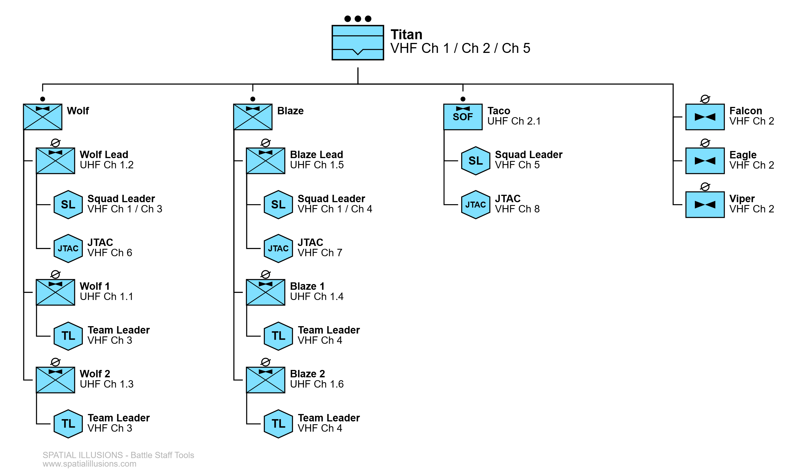

# Comunicazione e Radiofonia

Questa sezione copre la standardizzazione delle procedure di comunicazione usate dal Network Bagigi.

## La mod radio

Entriamo prima in dettaglio sulla mod radio che utilizziamo, le sue particolarità e funzionalità a nostra disposizione.

Il Network Bagigi si è standardizzato sulla mod [ACRE2 - Bagigi Fork](https://steamcommunity.com/sharedfiles/filedetails/?id=3012268676) come mod radio per le operazioni Arma 3. 
Essa ci permette di parlare con gli altri giocatori in missione mediante un plugin di [TeamSpeak3](https://teamspeak.com/en/downloads/#ts3client), che viene auto-installato durante l'avvio di Arma 3, se la mod è stata attivata.

Le informazioni in questa guida fanno riferimento alla [wiki di ACRE2](https://acre2.idi-systems.com/wiki/user/overview). La lettura è consigliata in particolare per argomenti non trattati su questa pagina, come [i GUI delle radio](https://acre2.idi-systems.com/wiki/radios/overview).

Mod utili compatibili con questo Fork sono:

- [ACRE2 Bagigi Animations](https://steamcommunity.com/sharedfiles/filedetails/?id=3126781754) per le animazioni delle mani che interagiscono con le varie radio.
- [ILBE Pack for ACRE2 - Bagigi Repack](https://steamcommunity.com/sharedfiles/filedetails/?id=3065316263) che aggiunge vari modelli e mimetiche di zaini radio con antenne sporgenti, di capienza sufficiente per contenere una qualsiasi radio da zaino.

### La voce diretta

La simulazione della voce ci permette di sentire gli altri giocatori **direzionalmente**, con un volume nelle nostre orecchie che dipende dai seguenti fattori:

- La distanza tra di noi.
- La presenza di compartimenti veicolari o terreno/muri tra di noi.
- Il volume con cui stanno parlando.

Questo ultimo fattore si riferisce alla funzionalità di ACRE2 che ci permette di modificare il "volume" della nostra voce, dal bisbiglio al grido.

Tenendo premuto ++tab++ e girando la rotellina del mouse possiamo selezionare velocemente l'impostazione desiderata o semplicemente controllare quella attuale.

!!! warning "Parlare a voce troppo alta rivela la nostra presenza anche ai Bot nemici"

La seguente tabella elenca i 5 volumi di voce disponibili, con le relative distanze massime udibili e le situazioni più adatte all'utilizzo.

| Volume della voce | Alto (m)| Basso (m) | Quasi impercettibile (m) | Quando usarlo? |
| -------- | -------- | -------- | -------- | -------- |
| `1/5` | 1 | 2 | 13 | Comunicazione a singoli durante briefing o CQB con nemici vicinissimi |
| `2/5` | 3 | 15 | 55 | Comunicazione con i propri buddy senza intralciare il resto del gruppo, oppure con il proprio gruppo se c'è possibile presenza nemica nelle vicinanze |
| `3/5` | 8 | 30 | 100 | Adatto al 90% delle situazioni sul campo, buona via di mezzo tra non intralciare/svelarsi e essere sentiti dal proprio gruppo |
| `4/5` | 12 | 45 | 145 | Situazioni di combattimento in cui dobbiamo farci sentire da tutta una squadra, con buddy-team distribuiti a >15m di distanza |
| `5/5` | 15 | 55 | 195 | Comunicazione chiara con un gruppo distaccato o altre squadre, specialmente in scenari senza radio personali |

!!! note "Mentre trasmettiamo in radio, il volume parlato (indipendente da quello trasmesso) viene ridotto di un singolo livello."

### La propagazione delle onde radio

La propagazione delle onde radio di banda [VHF](https://it.wikipedia.org/wiki/Very_high_frequency)/[UHF](https://it.wikipedia.org/wiki/Ultra_high_frequency) viene simulata da ACRE2 con un elevato livello di realismo, secondo il modello reale comunemente noto come [multipath](https://it.wikipedia.org/wiki/Multipath_fading), che si comporta secondo i seguenti criteri:

- Propagazione LOS con [attenuazione di spazio libero](https://it.wikipedia.org/wiki/Attenuazione_di_spazio_libero).
- Propagazione mediante riflessioni di onde sul terreno circostante.
- Riflessioni di onde dal terreno circostante interferiscono con l'onda LOS o altre riflessioni e possono degradare il segnale ricevuto.
- Se non si è in LOS e non c'è terreno circostante su cui il segnale può riflettere per giungere al destinatario, non ci sarà collegamento anche se la distanza tra i due è di <100 metri.

Visto che non esistono ancora radio subacquee (per i sub), ma nella realtà è più facile comunicare a gesti sott'acqua, il compromesso attuale attuato dall'ACRE2 è che la voce diretta viene bloccata, mentre le radio funzionano normalmente.

### Le radio personali

Le radio di ACRE2 non utilizzano lo slot della radio nel proprio inventario come forse avete visto dalla TFAR. Invece devono essere messe in un qualsiasi contenitore, l'uniforme, il corpetto o lo zaino stesso. Alcune radio "da zaino" possono essere portate *(sorpresa!)* solo in uno zaino.

| Nome Radio | Descrizione | Potenza di Trasmissione | Portata urbana / ideale |
| ---------- | ----------- | ----------------------- | ----------------------- |
| [AN/PRC-343](https://acre2.idi-systems.com/wiki/radios/an-prc-343) | Una piccola radio tascabile di portata molto limitata, i suoi blocchi/canali sono compatibili solo con altre PRC-343. In dotazione a tutti i fanti in scenari moderni per comunicazioni a livello di gruppo/squadra. | 100 mW | 400 / 850 m |
| [AN/PRC-148](https://acre2.idi-systems.com/wiki/radios/an-prc-148) | Una radio a medio raggio, usa gli stessi canali delle PRC-152/117F. Viene usata dai TL/SL per comunicazioni a livello di squadra/plotone. | 5 W | 4 / 6 km |
| [AN/PRC-152&#40;c&#41;](https://acre2.idi-systems.com/wiki/radios/an-prc-152) | Una radio a medio raggio, usa gli stessi canali delle PRC-148/117F. Viene usata dai TL/SL per comunicazioni a livello di squadra/plotone. | 5 W | 4 / 6 km |
| [AN/PRC-117F](https://acre2.idi-systems.com/wiki/radios/an-prc-117f) | Una radio a lungo raggio, trasportabile solo negli zaini, usa gli stessi canali delle PRC-148/152. Viene usata dai SL / PL e JTAC per comunicazioni a lungo raggio, a livello di plotone/compagnia | 20 W | 10 / 20 km |
| [AN/PRC-77](https://acre2.idi-systems.com/wiki/radios/an-prc-77) | Una radio da zaino degli anni '60, usata in epoca Vietnam. Viene impostata con varie frequenze, compatibili solo con altre PRC-77. Utilizzata principalmente a livello di plotone/compagnia. | 4 W | 2 / 4 km |
| [SEM 52 SL](https://acre2.idi-systems.com/wiki/radios/sem-52-sl) | Una radio dell'esercito tedesco, compatibile solo con altre SEM 52SL/70. Utilizzata a livello di squadra. | 1 W | 1 / 3 km |
| [SEM 70](https://acre2.idi-systems.com/wiki/radios/sem-70) | Una radio da zaino dell'esercito tedesco, compatibile solo con altre SEM 52SL/70. Ulizzata a livello di plotone. | 4 W | 2 / 4 km |
| [Baofeng BF-888S](https://acre2.idi-systems.com/wiki/radios/bf-888s) | Una radio civile a medio raggio, con canali compatibili solo con altre Baofeng. Utile a forze paramilitari o eserciti meno equipaggiati. | 5 W | 3 / 5 km |

### Keybind e concetti utili

In ACRE2 tutte le radio personali sono equivalenti in termini di UI, non esiste distinzione tra SR e LR per i keybind come sulla TFAR. Questo comporta un modo particolare di gestire le proprie radio, che offre però alcuni vantaggi.

#### I tasti PTT

Con "Push To Talk" si intende un tasto che premiamo per trasmettere con una determinata radio. ACRE2 permette l'assegnazione di 3 tasti, identificati nel GUI sempre con il rispettivo numero:

1. ++caps-lock++
2. ++ctrl+caps-lock++
3. ++alt+caps-lock++

Quando equipaggiamo una radio, essa verrà assegnata al primo PTT libero. Se ne equipaggiamo più di 3, quelle in eccesso saranno comunque udibili, ma non ci potremo trasmettere senza assegnarle un PTT.

Possiamo in un qualsiasi momento modificare l'assegnazione dei PTT, mediante opportune auto-interazioni ACE3 sulla radio desiderata. 
Questa funzione diventa utile nel caso in cui siamo parte di un elemento di comando più lontano dal combattimento, dove ci torna più comodo avere la nostra `AN/PRC-152/117F` più usata su PTT1, relegando la `AN/PRC-343` al PTT2 o 3.

#### La radio "attiva"

Siccome possiamo equipaggiare molte radio, serve un modo per determinare su quale avranno effetto i nostri keybind di manipolazione. Qui subentra il concetto di radio "attiva" dell'ACRE2.

La nostra radio "attiva" è **sempre** l'ultima radio su cui abbiamo trasmesso. Possiamo però anche determinarla manualmente (fino alla prossima trasmissione), sia mediante l'opportuna autointerazione, che ciclandola tra le radio che abbiamo appresso con ++alt+shift+caps-lock++.

Così potremo usare i seguenti comandi per manipolare velocemente l'attuale radio "attiva", senza dover ricorrere alla relativa autointerazione o manipolazione del GUI:

- ++ctrl+arrow-up++ / ++arrow-down++ per cambiare il canale della radio (non su radio da zaino).
- ++ctrl+alt+caps-lock++ per aprire il GUI della radio.
- ++ctrl+shift+arrow-left++ / ++arrow-up++ / ++arrow-right++ per impostare l'orecchio da cui sentiamo la radio su sinistro/entrambi/destro.

#### Abbassare la cuffia

Esistono situazioni, in particolare nel ruolo di caposquadra o superiori, in cui comunicazioni radio ostacolano una contemporanea conversazione a voce di maggiore importanza.

Con ++ctrl+shift+arrow-down++ (o la relativa autointerazione) possiamo "abbassare la cuffia". Il risultato è una immediata riduzione del volume di tutte le nostre radio, abbastanza da non ostacolare alcuna comunicazione a voce, senza però mutarle del tutto.

### Interfono e radio veicolari

#### L'Interfono/Intercom

Velivoli e veicoli corrazzati montano quasi sempre un "interfono" che ci permette di comunicare in modo chiaro con altri membri dell'equipaggio e passeggeri imbarcati, senza essere ostacolati dal rumore generato dal veicolo o la distanza tra i nostri sedili.

Su praticamente tutti i veicoli con interfono, esso si suddivide in uno o due canali:

- ^^Crew/Equipaggio:^^ 
  Viene collegato in automatico quando si entra su posti di pilota, artigliere o comandante. 
  I passeggeri possono collegarsi a questo canale solo in 1-2 contemporaneamente, al fine di non disturbare l'equipaggio (lasciatele quindi libere per i leader imbarcati). Inoltre il collegamento userà la modalità PTT, richiedendo l'assegnazione e utilizzo del rispettivo keybind per trasmettere sul canale.
- ^^Pax/Passeggeri:^^ 
  Canale di libera comunicazione per tutto il personale imbarcato, sia per l'equipaggio che i passeggeri. Questo non significa però che conviene collegarsi tutti. Specialmente su velivoli con >12 posti conviene collegarsi solo da SL/TL e rispettivi vice, in modo da lasciare il canale libero per il coordinamento tra leader.

L'interfaccia dell'intercom è apribile mediante interazioni ACE3 su veicolo>intercom>canale, oppure il keybind ++ctrl+shift+tab++. Essa è modellata secondo il reale sistema ["Full Function Crew Station"](https://chelton.com/media/51ajstyf/lv2-brochure.pdf), permettendoci di impostare ogni canale intercom con una modalità adatta alle nostre esigenze.

Per una spiegazione più approfondita dell'interfaccia e gli utilizzi delle 4 manopole, leggete la [guida ufficiale di ACRE2 sull'intercom](https://acre2.idi-systems.com/wiki/user/vehicle-intercom).

#### Telefono fanteria

Alcuni veicoli corrazzati permettono ad un fante sbarcato di collegarsi all'interfono dall'esterno, per comunicare con l'equipaggio senza richiedere l'utilizzo di radio o lo sporgimento del comandante dalla botola.

Possiamo utilizzarlo (se disponibile) mediante l'opportuna interazione ACE3 al centro o sul retro del veicolo. Successivamente trasmetteremo di continuo sul canale intercom scelto, finché rimaniamo consci ed entro la distanza massima di ~3m dal veicolo.

Sempre sul veicolo potremo trovare interazioni per riporre il telefono fanteria o cambiare il canale. Possiamo inoltre passare il telefono ad un altro fante vicino, mediante l'opportuna interazione sul suo bacino.

#### Radio "rack" veicolari

Veicoli e velivoli hanno dei "rack" radio propri con ampia potenza di trasmissione. Si differenziano principalmente in due tipologie:

- ^^Rack con radio non rimovibili:^^ 
  Sono quelli più comunemente usati, praticamente sempre presenti su veicoli pesanti e velivoli. Possiamo "usarli" con l'apposita interazione (o con la manopola Work dell'intercom, sui veicoli corrazzati), così verranno aggiunti alla nostra lista di radio personali.
    - `AN/VRC-103`: monta una `AN/PRC-117F` con potenza aumentata da 20W a 50W;
    - `AN/VRC-64`: monta una `AN/PRC-77` con potenza aumentata da 4W a 50W;
    - `SEM 90`: monta una `SEM 70` con potenza selezionabile di 4W o 40W;
- ^^Rack per radio montabili:^^ 
  Possiamo trovarli principalmente su veicoli leggeri come macchine/MRAP. Permettono il collegamento di una radio tascabile a medio raggio come la PRC-148 o PRC-152 (che rimarrà sul mezzo finché disconnessa), al fine di utilizzare la più prestante antenna del veicolo.
    - `AN/VRC-110`: può montare una `AN/PRC-152`, aumentando la sua potenza da 5W a 20W;
    - `AN/VRC-111`: può montare una `AN/PRC-148`, aumentando la sua potenza da 5W a 20W;

### Antenne piazzabili

Antenne montabili che possono essere piazzate al suolo e collegate ad una nostra radio per aumentare la sua potenza di trasmissione, e di conseguenza la portata del segnale.

Qui sotto sono elencati i vari oggetti di inventario che possiamo montare, mediante auto-interazioni ACE3, in due tipologie di antenne:

- ^^Antenne convenzionali:^^ 
  Esse migliorano la portata della radio collegata aumentando la potenza di trasmissione, ma anche elevando l'antenna sopra il terreno bloccante. La propagazione rimane comunque LOS, però la potenza maggiore aumenta l'efficacia di riflessioni contro il terreno.
    - `VHF30108 GS`: l'antenna "Ground Spike" montabile, alta circa 2.4m, compatibile con `AN/PRC-148`, `-152`, `-117F`, `-77` e `SEM 70`;
    - `VHF30108 Mast`: oggetto di "albero", montabile su un GS per estenderlo in GSM;
    - `VHF30108 GSM`: oggetto antenna + albero per 6.4m di altezza, smontabile in GS per separare l'oggetto Mast;
- ^^Antenne SATCOM:^^ 
  Questo tipo di antenna permette la comunicazione radio con protocolli di comunicazione particolari, utilizzando un satellite geosincrono come relay. La portata viene così estesa effettivamente su tutto il pianeta, l'unico requisito è che sia l'antenna trasmettente che quella ricevente devono avere una LOS libera verso il cielo.
    - `RF-3080`: antenna SATCOM piazzabile, compatibile solo con `AN/PRC-152` e `-117F`;

### Radio "esterne"

La ACRE2 introduce una meccanica che ci permette di usare una radio collocata su un altro giocatore, senza doverla prima spostare nel nostro inventario.

Se una radio è stata condivisa dal proprietario mediante autointerazione ACE3 (oppure è morto, svenuto o ammanettato) potremo utilizzare un'interazione sul suo bacino per "prendere la cuffia/cornetta". Successivamente potremo usarla come se fosse una radio nel nostro inventario, finché rimaniamo entro 2 metri dal proprietario.

Questa meccanica permette per esempio ad un caposquadra di comunicare con la radio del proprio radiofonista, senza doverlo usare come passaparola. 
Inoltre, nel caso in cui il nostro caposquadra viene abbattuto, un soccorritore o medico impegnato nelle cure può prendere la cuffia per mantenere le comunicazioni con l'esterno, in attesa del rinvenimento.

## La radiofonia

Dettagliamo quindi la vera e propria "radiofonia", ovvero come strutturare le comunicazioni radio, al fine di conversare in maniera chiara ed efficente.

### La maglia radio

È comunemente collegata al ORBAT presente nel briefing della missione. Così possiamo vedere velocemente su quali canali opereranno le varie unità presenti nello scenario.

Prendiamo come esempio la seguente maglia radio, raffigurante una Task Force aviotrasportata su scala di plotone, con asset esterni (velivoli e unità SF) assegnati ad essa per la missione pianificata.

Notiamo gli indicatori di banda accanto alle unità. In ambito moderno tendiamo a indicare con `UHF` le radio a corto raggio, come la `AN/PRC-343`, mentre `VHF` sta a indicare radio a medio-lungo raggio come `AN/PRC-148`, `-152` e `-117F`.

Dopo la banda segue un numero di canale/frequenza, come `Ch 3` per i canali singoli di radio MR/LR, `Ch 2.3` per indicare il Blocco 2 e Canale 3 della `AN/PRC-343`, oppure una frequenza nel formato `VHF 33.50 MHz` per radio come la `AN/PRC-77`.

Se l'indicatore di banda+canale è accanto all'unità stessa, come `UHF Ch 1.3` per il gruppo `Wolf 2`, esso va a indicare il canale ^^intra-unità^^, ergo quello utilizzato dai membri di `Wolf 2` per comunicare tra di loro. 
Se invece l'indicatore si trova accanto a una figura di comando o assetto aereo, esso indica il canale ^^inter-unità^^ che viene usato da quella figura/assetto per comunicare con l'esterno. Nel caso della squadra `Blaze`, `VHF Ch 4` verrà utilizzato dallo Squad Leader in `Blaze Lead` e i Team Leader di `Blaze 1` e `Blaze 2` per comunicare tra di loro. Mentre `VHF Ch 2` è la frequenza aviazione, utilizzata per coordinamento tra il comando `Titan` e gli elicotteristi.

### Fraseologia fondamentale

Le regole e brevity fondamentali con cui comunicare, al fine di garantire un coordinamento rapido e chiaro.

#### Concetti di base

- Pensiamo a ciò che vogliamo comunicare prima di trasmettere, in modo da evitare spiegoni lunghi che intasano il canale.
- Specialmente quando trasmettiamo serie di numeri, parliamo lentamente per evitare confusione.
- Quando dobbiamo fare lo spelling di una parola usiamo sempre [l'alfabeto fonetico NATO](https://it.wikipedia.org/wiki/Alfabeto_fonetico_NATO#Le_lettere).
- Si comunica quasi sempre in half-duplex, quindi con radio che non possono ricevere mentre trasmettono. Per questo bisogna stare attenti a non "calpestare" comunicazioni di altri, visto che terzi riceveranno solo interferenza quasi intelliggibile.

#### Utilizzo di callsign/nominativi

I callsign sono nomi in codice, utilizzati per identificarci su un canale radio.

Idealmente, i callsign utilizzati su uno stesso canale sono:

- Univoci (non devono esistere doppie assegnazioni)
- Facilmente distinguibili foneticamente nella lingua parlata
- Ambigui sulla gerarchia (es: nessun c/s "Comando", per l'eventualità di intercettazione delle nostre comunicazioni da parte del nemico);

Quando iniziamo una comunicazione dobbiamo nominare sempre ^^prima il callsign del destinatario^^, poi quello del mittente (il nostro). Per venire incontro alla tendenza del cervello umano di prestare maggiore attenzione alla prima parola di una frase, massimizzando così la probabilità di essere *sentiti* da un fante in battaglia.

Per separare i callsign possiamo usare la parola =="qui"==, oppure una breve pausa, MAI altre parole come "da".

Esempi di comunicazioni corrette (distinte tra di loro), sempre nel formato `[mittente] messaggio`:

> [Wolf] Blaze, Wolf, richiediamo supporto medico in coordinate 026-158.

!!! note "Se comunichiamo (per esempio) sul canale intra-squadra di Blaze, possiamo anche omettere la parte comune "Blaze" dei callsign, visto che non c'è ambiguità sul mittente o destinatario."

> [Blaze Lead] ~~*Blaze*~~ 1, qui ~~*Blaze*~~ Lead, ricongiungersi per esfiltrazione, nella radura 200 metri a Ovest di voi.

#### Brevity comuni

Le "brevity" sono parole *brevi* utili ad *abbreviare* le comunicazioni ^^in situazioni consone^^.

<!-- Alcune sono tratte dalla fraseologia aeronautica ENAC https://www.enac.gov.it/repository/ContentManagement/information/P333420440/LG_2015_002_ATM_150928.pdf -->
| Brevity (IT/EN) | Significato |
| --- | --- |
| Approvato/Approved | Accordiamo il permesso per l'azione richiesta/proposta |
| Attendere/Hold | Attendiamo un successivo ordine di manovra o ingaggio prima di muoverci o aprire il fuoco |
| Confermate/Confirm | Richiesta di confermare la data intenzione |
| Contattate/Contact | Contattate il dato callsign e canale per future richieste |
| Continuate/Continue | Conferma di continuare l'attuale azione (manovra/assalto/ritirata) |
| Disregard/Ignorate | Ignorare una precedente richiesta/ordine errata o superflua |
| Impossibilitati/Unable | Non siamo in grado di soddisfare la precedente richiesta |
| Monitorate/Monitor | Ascoltate il dato canale per ricevere future richieste/ordini |
| Ricevuto/Roger | Abbiamo ricevuto e compreso la comunicazione precedente |
| Richiediamo/Request | Richiesta di vario genere (supporti/rifornimenti) |
| Ripetere/Say Again | Richiesta di ripetere una comunicazione precedente che è stata persa |
| Wilco | "Will Comply", abbiamo compreso la comunicazione precedente e ci atterremo ad essa |

!!! note "Nelle sezioni successive trattiamo brevity aggiuntive che richiedono descrizioni più approfondite."

#### Prova radio

Per verificare quanto bene un'altra unità ci riceve, possiamo effettuare velocemente una prova di collegamento (in inglese "Radio check"). 
La qualità di ricezione viene comunicata secondo la seguente scala.

<!-- Secondo la fraseologia aeronautica ENAC https://www.enac.gov.it/repository/ContentManagement/information/P333420440/LG_2015_002_ATM_150928.pdf -->
| Scala | Qualità di ricezione |
| ----- | -------------------- |
| "radio 1" | incomprensibile |
| "radio 2" | comprensibile a tratti |
| "radio 3" | comprensibile con difficoltà |
| "radio 4" | comprensibile |
| "radio 5" | perfettamente comprensibile |

> [Wolf] Blaze, Wolf, ==prova radio==.

> [Blaze] Wolf, qui Blaze, ==radio 5==, avanti.

#### Standby

In situazioni dove non possiamo rispondere immediatamente ad una richiesta, possiamo usare la brevity =="standby"== per comunicare al richiedente che lo abbiamo compreso, ma risponderemo solo nel prossimo futuro (onde evitare che lui la ripeta, pensando che non lo abbiamo sentito).

> [Wolf] Blaze, qui Wolf, interrogativo, possiamo procedere con il movimento su obj *(obbiettivo)* Juliet?

> [Blaze] Wolf, Blaze, ==standby==.

> (poco tempo dopo)

> [Blaze] Wolf, Blaze, procedere per obj Juliet.

??? failure "Errori comuni"
    Lo "standby" NON va confermato con un ulteriore "ricevuto" (o simili), siccome rischierebbe di "calpestare" la risposta effettiva, che potrebbe arrivare secondi dopo. 
    Lo "standby" NON implica l'interruzione di un movimento, di conseguenza NON va usato per ordinare ad un'unità di fermarsi.

#### Parole terminali

Servono ad esplicitare al destinatario se richiediamo o meno una conferma di ricezione.

- Se richiediamo una conferma, terminiamo la comunicazione con =="passo"==.
- Se **non** la richiediamo, terminiamo la comunicazione con =="fine"== (il destinatario può comunque continuare a comunicare per correggere/aggiungere informazioni).
- Se non utilizziamo alcuna parola terminale, diamo effettivamente la scelta al destinatario se rispondere o meno. Comunque, nella maggioranza delle conversazioni, è da considerarsi implicito il =="passo"==.

!!! question "Probabilmente conoscete "chiudo" come analogo di "fine". Noi però ci atteniamo alla convenzione dell'Esercito Italiano, che vede come corretto solo il "fine"."

> [Wolf] Blaze, qui Wolf, avanzate su obbiettivo Yankee, ==passo==.

> [Blaze] Wolf, qui Blaze, ricevuto, ==fine==.

> [Wolf] Blaze, Wolf, forze meccanizzate in arrivo, mantenete postazioni difensive, ==passo==.

> [Blaze] Wolf, Blaze, manteniamo, ==fine==.

??? failure "Errori comuni"
    Combinazioni di entrambe le parole, come "passo e chiudo" o "passo e fine", sono **categoricamente sbagliate** (oltre ad essere superflue). Se ci pensiamo, combinare due brevity con sensi opposti, per creare una terza brevity con un significato ancora diverso, non ha senso e serve solo ad aumentare il potenziale di equivoci.

#### Conferma e negazione

- Per confermare una domanda o readback usiamo =="confermo"/"affermo"==.
- Come negazione invece usiamo =="negativo"==.

> [Blaze] Wolf, qui Blaze, spostatevi su coordinate 135-210, passo.

> [Wolf] Blaze, qui Wolf, ricevuto, spostiamo in *125*-210, fine.

> [Blaze] Wolf, Blaze, ==negativo==, 135-210, passo.

> [Wolf] Blaze, qui Wolf, ricevuto 135-210.

> [Blaze] Wolf, Blaze, ==confermo==, fine.

??? failure "Errori comuni"
    Parole come "affermativo" o "positivo" **sono sbagliate**, siccome le loro ultime sillabe sono identiche a quelle di "negativo", introducendo il potenziale di equivoci.

#### Correzione

Anche ai radiofonisti più esperti capita di sbagliare, ma quando succede non si "impappinano". Invece correggono con chiarezza il proprio errore e procedono, senza interrompere il flusso della comunicazione.

> [Blaze] Wolf, qui Blaze, carro nemico in avvicinamento da Nord-Est, al momento in coordinate 135-*230*... ==correggo==, 135-210, passo.

> [Wolf] Blaze, Wolf, ricevuto, rimanete nascosti, stiamo coordinando CAS, fine.

#### Separazione

Quando vogliamo , usiamo =="break"==.

Quando vogliamo indirizzare parti della stessa trasmissione a callsign diversi, usiamo =="break break"== o =="separazione"== per separarle.

> [Wolf] Blaze, qui Wolf, avanzate su obj Lima, ==break break==, Lion coprite i boschi a Ovest da probabile fiancheggiamento nemico, passo.

#### Cambio di canale

### Procedure avanzate

Al fine di comunicare in brevi parole delle intenzioni complesse, esse vanno standardizzate sotto forma di procedure comuni. Qui vedremo alcune di queste procedure, applicabili in **situazioni specifiche**.

Ricordiamo che, come per le brevity, la loro forzatura in situazioni poco adatte può creare ulteriori equivoci, quindi usatele in modo consono.

#### Esecutivo all'ordine

Utile per stabilire in anticipo degli ordini di manovra complessi, per poi ordinare la loro esecuzione con una comunicazione breve.

> [Blaze Lead] Tutta la maglia, qui Blaze Lead, ==esecutivo all'ordine:== Blaze 1 sopprime il bunker nemico con priorità di ingaggio su MG statici, Blaze 2 distrugge i carri nemici con i loro lanciarazzi, passo.

> (le squadre interpellate confermano gli ordini e si preparano all'esecuzione)

> [Blaze Lead] Blaze, ==esecutivo! esecutivo! esecutivo!==

#### Assicuro

Per coordinare in anticipo delle manovre assieme ad altri elementi ci torna utile questa procedura, che possiamo utilizzare per richiedere in modo chiaro se l'interpellato sarà abile ad eseguirla.

> [Blaze] Wolf, qui Blaze, ==assicurate== di essere abili all'avanzata su obj India tra 2 minuti.

Conferma, siamo abili:

> [Wolf] Blaze, Wolf, ==assicuro==.

Negazione, non ci riteniamo abili per un qualsiasi motivo (es: feriti, munizioni, movimento rallentato a piedi):

> [Wolf] Blaze, Wolf, ==negativo==, ci servono almeno 6 minuti per stabilizzare i nostri feriti gravi.
